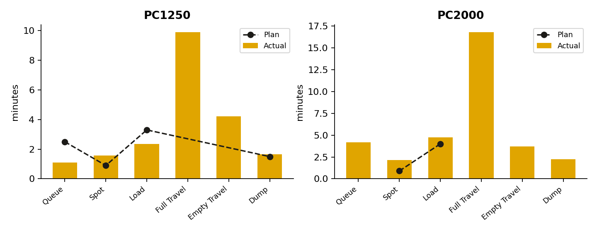

# Mining Fleet Cycle-Time & Production Analysis

Analysis of a mining haul-fleet dataset (excavator + truck cycle times) to
evaluate production performance against an operating plan, and to surface
actionable insights for dispatch and fleet management.

**[View the live dashboard →](#)** *(replace with your GitHub Pages link after enabling it — see below)*



## Background

Dataset: 165 truck-loading cycles recorded over a single shift window
(12:54–16:45) across a fleet of 22 excavators (8× PC1250, 14× PC2000) and
81 haul trucks (HD785), plus a target/plan sheet with benchmark cycle-time
components and payload.

## Key findings

- Fleet hauled **12,311 tons** across 165 cycles; average payload was 74.6 t
  against a 95 t target — but **19.4% of cycles (32) recorded zero tons**,
  which explains almost all of the shortfall (loaded-only cycles average 92.6 t).
- **PC2000 cycles run 63% longer than PC1250** (33.9 vs 20.8 min), driven mainly
  by haul distance (full-travel duration), not loading speed.
- **Spot time exceeds plan** for both excavator models.
- **15:00–16:00 is the congestion peak** — 50% of all cycles and the highest
  average queue time in the shift.
- Excavator utilization is uneven: the busiest unit served **9x more cycles**
  than the least-used one.

Full write-up with recommendations: [`report/Fleet_Analysis_Report.docx`](report/Fleet_Analysis_Report.docx).

## Repo structure

```
├── data/                            # Raw dataset
├── src/analysis.py                  # Reproducible analysis: cleans data, computes
│                                     # metrics, generates dashboard_data.json + charts
├── dashboard/
│   ├── index.html                    # Self-contained interactive dashboard
│   └── dashboard_data.json           # Data consumed by the dashboard (generated)
├── images/                          # Chart images used in the report (generated)
├── report/
│   └── Fleet_Analysis_Report.docx     # Written findings & recommendations
└── notebooks/                        # (optional) exploratory analysis notebook
```

## Reproducing the analysis

```bash
pip install -r requirements.txt
python src/analysis.py
```

This regenerates `dashboard/dashboard_data.json` and the chart images in
`images/` from the raw data in `data/`.

## Tools used

Python (pandas, matplotlib) for data cleaning and analysis; plain HTML/JS
(Chart.js) for the interactive dashboard; python-docx/docx-js for the written
report.

## Viewing the dashboard

Open `dashboard/index.html` directly in a browser — it's fully self-contained,
no server required. To host it as a live portfolio link:

1. Push this repo to GitHub.
2. Go to **Settings → Pages**, set source to the `main` branch, root folder (or `/dashboard` if you want the dashboard as the site root).
3. Your dashboard will be live at `https://<username>.github.io/<repo-name>/dashboard/`.

---
Prepared by Abiyu Raihan.
